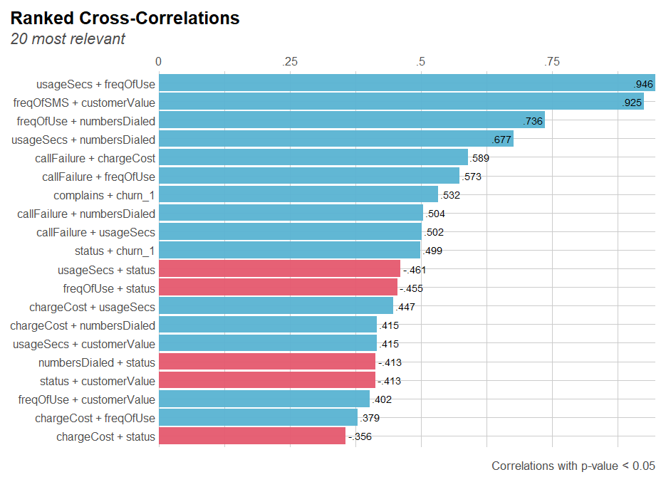
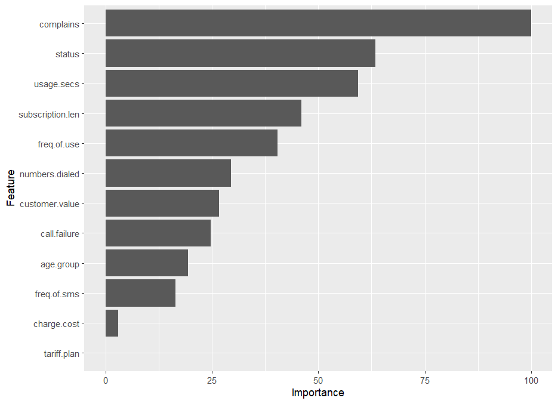

# Predicting-customer-churn project

This project is my first dive into the R programming language. I did some EDA and analysis on the possible reasons for customer churn using dataset obtained from the [UCI website](https://archive.ics.uci.edu/dataset/563/iranian+churn+dataset). The dataset was obtained from an Iranian telecom company over the space of 12 months. All of the columns were collected over nine months excluding the target feature. See the hyperlink above for more information and background on the dataset.

## Project aims/goals

The aims of this project are as follows:

1. Carry out extensive EDA on the dataset and extract business insights.
2. Answer some premeditated questions regarding the data through the EDA process.
3. Train and optimize an ML model for predicting customer churn.
4. Identify the main features responsible for customer churn.

## Data cleaning and EDA (PART 1)

The dataset contains 3,150 rows and 13 features. The description of the features are presented below:
- Call Failures: number of call failures
- Complains: binary (0: No complaint, 1: complaint)
- Subscription Length: total months of subscription
- Charge Amount: Ordinal attribute (0: lowest amount, 9: highest amount)
- Seconds of Use: total seconds of calls
- Frequency of use: total number of calls
- Frequency of SMS: total number of text messages
- Distinct Called Numbers: total number of distinct phone calls 
- Age Group: ordinal attribute (1: younger age, 5: older age)
- Tariff Plan: binary (1: Pay as you go, 2: contractual)
- Status: binary (1: active, 2: non-active)
- Churn: binary (1: churn, 0: non-churn) - Class label
- Customer Value: The calculated value of customer

In the loaded dataframe, some of these features are categorical features disguised as numerical features. Two dataframes were created to distinguish both and used depending on the task. Data cleaning was carried out by renaming some of the column names for simplicity and compactness. Three columns (`[FN]`, `[FP]` and `[Age]`) were dropped because there was no information about them. The `[Age]` column was a categorical feature (instead of being a continuous variable). The data set had no missing values. In the `[data_exploration_analysis]` script, comprehensive EDA process and some statistical analysis were carried out. Using the data, I was able to find answers to the following questions:

1. What could be the main causes of customer churn?
2. What is the time interval for customers to churn?
3. From insights generated from the EDA process, is it possible to discover how customers can be retained?
4. What recommendations observed from the EDA process can avoid customer churn?
5. What other insights and interesting information can be observed from the data?

Bar charts were used to visualize the categorical features. Histograms were used to visualize the numerical features. Box plots were used to visualize and observe outliers. Scatter plots were used to observe the relationship between two numerical features and the target feature. Violin plots were used to observe the distribution of some numerical and categorical features. After an extensive and thorough analysis, the following were the answers obtained through the EDA process:

1. What could be the main causes of customer churn?

    Answer: The data points to three main features as the cause of customer churn:
    - Complains (customers who have complains)
    - Status (non-active customers have the highest churn) It seems mostly likely that the customer complains are not attended to. Many of customers that had complains churned. Also the most majority of customers churned because they were no longer active on the platform.
    - It was also observed that customers on the "pay-as-you-go" tariff plan churned the most compared to those on a contract.

<p float="left">
    
     
    
</p>

2. What is the time interval for customers to churn?

    Answer: Customers begin to churn right from the time they subscribe to the network. The highest churn rate (almost 300 customers) was between 30 and 40 (units of measurement unknown).


3. From insights generated from the EDA process, is it possible to discover how customers can be retained?

    Answer: A major issue seems to be that the network is not attending to the complains of the customers. A large number of customers churn due to this.
4. What recommendations observed from the EDA process can avoid customer churn?

    Answer: The data reveals that most of the customers that churn are subscribed to the "pay-as-you-go" tariff plan. Probably make the contractual plan the gold standard by making the requirements for the "pay-as-you-go" plan very difficult. Or as an alternative, offer more incentives to those on the contract plan. Customers on the contractual plan rarely churn.
5. What other insights and interesting information can be observed from the data?

    - Customers that churned have less than 100 `[Frequency of Use]` and around 600 `[Seconds of Use]`.
    - Customers that have `[Customer Value]` of 5000 and above almost never churn.
    - Customers that churn are the young age, middle age and old age. The oldest and youngest age do not churn.

    - The network charges does not influence customers' decision to churn.
    - The middle age are the largest age group in the dataset and they also have the highest churn rate.
    - The majority of customers that churn have a long subscription with the network. There is something they are probably not happy about.

For the sake of conciseness, the rest of the analysis can be observed from the R script. Some statistical analysis were also carried out by compraing the relevance of some features (`[Status]`, `[Complains]`, `[Tariff Plan]` and `[Customer Value]`) to the target label (`[Churn]`). Correlation between features were calculated and presented in the figure below


The bigger and greener the box, the stronger the positive correlation. The bigger and pinker the box, the stronger the negative correlation. The smaller the boxes, the weaker the correlation between the features. The correlation ranking of variables were also visualized



The strongest cross-correlations was observed between `[Seconds of use]` and `[Frequency of use]`, `[Frequency of SMS]` and `[Customer Value]`. This seems to make some logical sense. The results also agrees with the previous correlation between features plot.

The conclusion reached from the extensive EDA process was that the main features that influence customers churn are `[Status]`, `[Complains]` and `[Tariff Plan]`.

## Model selection and evaluation (PART 2)

Some further exploration was carried out before the modeling process started. Just to further observe the distribution of the categorical and numerical features in one shot


The outliers were treated by clipping them using the lower and upper quantiles. All was then set to split the dataset into the train test split using an 80% to 20% ratio respectively. Due to the imbalanced class in the target feature, the accuracy metric was not used. I instead used the ROC metric. A ten-fold cross validation technique was also used to mitigate the class imbalance. The model training was done by comparing different models performance. The compared models included Linear Discriminant Analysis (LDA), Classification and Regression Trees (CART), K-Nearest Neighbors (kNN), Support Vector Machines (SVM) and Random Forest (RF). The preferred model was the Random Forest classifier as it outperformed all the others. The feature importance obtained from the model also seems to agree with the initial EDA process



The results from the model were $\text{ROC}=98.2\%$, $\text{Precision}=86.9\%$, $\text{Recall}=96.8\%$ and $\text{Accuracy}=95.2\%$. Next step was to optimize the preferred model by carrying out hyperparameter tuning of some hyperparameters. The optimized model was validated using the test data and the new metric scores are $\text{ROC}=98.6\%$, $\text{Precision}=83.8\%$, $\text{Recall}=97.3\%$ and $\text{Accuracy}=95.2\%$. The AUC score for the optimized model was obtained as $98.6\%$.

The Receiver Operating Characteristic curve from the optimized model validation using the test dataset is visualized below:


The results obtained throughout the model training and optimization process is very questionable because no real-life data can have such a high evaluation metrics.

### Key takeaways
- Some of the reasons why I am suspicious of the high metrics is because the dataset contains some ambiguity in terms of the features that have no background information. There are also some concerns that the data might not be genuine real-life data.
- The insights from the EDA process and the model process seems to be in agreement. They both agree that the `[Complains]` and `[Status]` are the main features influencing customers churn.
- Some business recommendations will be that the company management should try to introduce requirements for the "pay-as-you-go" `[Tariff Plan]` quite difficult so customers opt for the "contractual" plan instead. Customers on this contract plan churn way lesser than those on the other plan.
- The business management should improve their customer care representatives by sending them for more extensive training. And they must ensure that all complains are duly attended to.

## Challenges 
 - The information that accompanied the dataset was insufficient and many of the features had vague units. This makes the analysis quite difficult. For example, the `[Charge Cost]` was a categorical feature. For `[Subscription Length]`, it wasn't clear what the length was measuring. 

## Future Goals
- Find out ways to improve the accuracy of the models. Optimize the Decision Tree Classifier and see if the ROC-AUC curve will improve as it is the most unbiased model.
- Develop a model within an ETL pipeline that will download live data from a Twitter API and make real-time predictions.

### Repo structure

```
├── README.md           <-- Markdown file explaining the project's 
|                              approach, methodology, and findings
│
├── Customer Churn.csv    <-- Original dataset used in preprocessing and
|                             training the classification model
│
├── model_train.R   <-- Script used for training and optimizing the model
│
├── data_exploration_analysis.R     <-- Script used for extensive EDA 
|                                        process and data cleaning
│
├── outputs            <-- Contains figures used in the README.md file
│
```


> Please reach out to me if you have further ideas or suggestions to improve this project. I am also very much open to collaborating. **I am available through e-mail** drsamuelsurulere@gmail.com